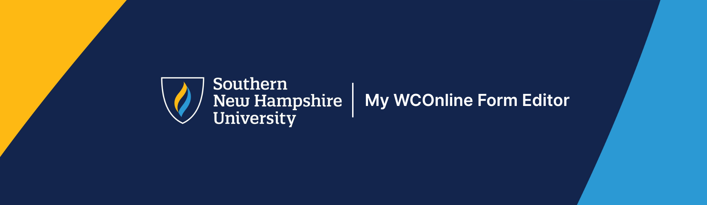
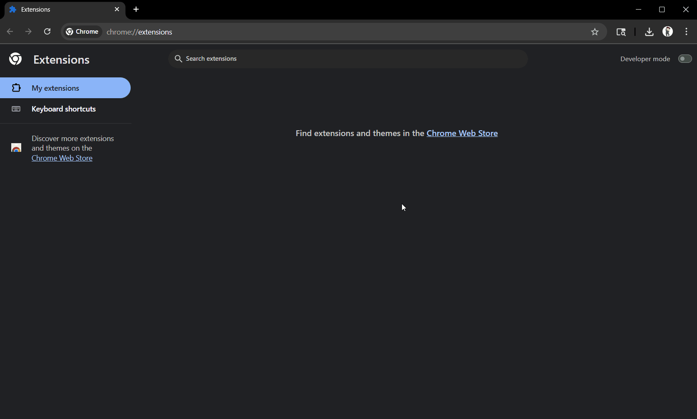
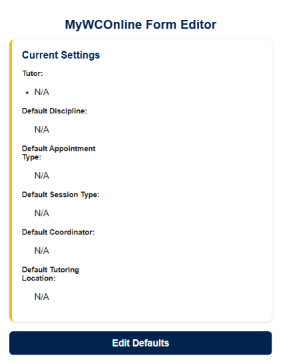
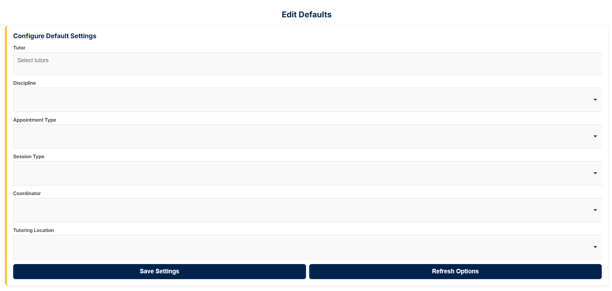

# MyWCOnline Form Editor



**A simple, intuitive Chrome Extension to streamline report forms in My WCOnline.**

## 🚀 Overview

The **MyWCOnline Form Editor** is a Chrome Extension that enhances the WCOnline Off-Schedule Report form interface by:  

- Pre-filling default selections for tutors, disciplines, appointment types, session types, coordinators, and locations. 
- Providing an easy interface to edit and save your default settings.
- Simplifying the scheduling workflow for admins and tutors. 

## ✨ Features

- Stores defaults in Chrome Storage for seamless auto-fill  
- Reduces CRF session start and end time selection from minute-by-minute to every 5 minutes
- Limited the session start and end time selection to normal university operating hours
- Customizable defaults for flexibility 
- Responsive design allowing for compatability across differing devices

## 📥 Download & Installation

### Chrome Webstore Install (Recommended)

The extension is avaliable via the [Chrome Webstore](https://chromewebstore.google.com/) (Maybe Soon)

### Developer Install

The extension is available on GitHub as a `.zip` file for local installation:

1. Clone the repository or download the ZIP:  
   ```bash
   git clone https://github.com/Justin-Perkins/WCOnlineFormEditor.git
   ```
   If downloaded as a ZIP folder, be sure to extract it.
2. Open Chrome and navigate to: `chrome://extensions/`  

3. Enable **Developer Mode** (top right)  

4. Click **Load unpacked** and select the folder containing the extension  



## ⚙️ Configuration

This extension grabs the list of tutors every time an Off-Schedule Report form is opened. ⚠️ It does not come with any settings installed upon a first intall! After download you must open an Off-Schedule Report form before configuring your extension settings.

### 1. Access the Form Editor
Click the extension icon in the Chrome toolbar to open the popup:

  

The popup shows your current default settings for each field.

### 2. Edit Defaults
Click **Edit Defaults** to open the editor page:

  

Here you can:  

- Add or remove default tutors
- Select default disciplines, appointment types, session types, coordinators, and locations
- Save your preferences

### 3. Save & Apply
After configuring, click **Save Settings**. Your selections will automatically be applied the next time you open a WCOnline Off-Schedule-Report form.  

## 📜 Licenses

- **MyWCOnline Form Editor code** — MIT License. See [`LICENSE`](./LICENSE).  
- **Choices.js library** — MIT License. See [`libs/CHOICES-MIT.txt`](./libs/CHOICES-MIT.txt).  
- **Inter font** — SIL Open Font License 1.1. See [`fonts/Inter/INTER-OFL.txt`](./fonts/Inter/INTER-OFL.txt).  
